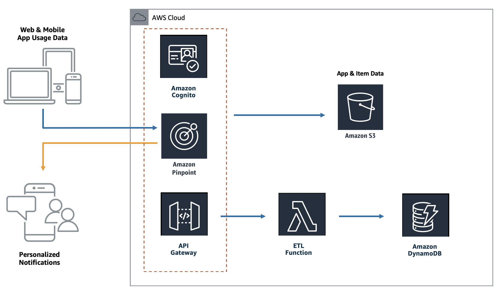
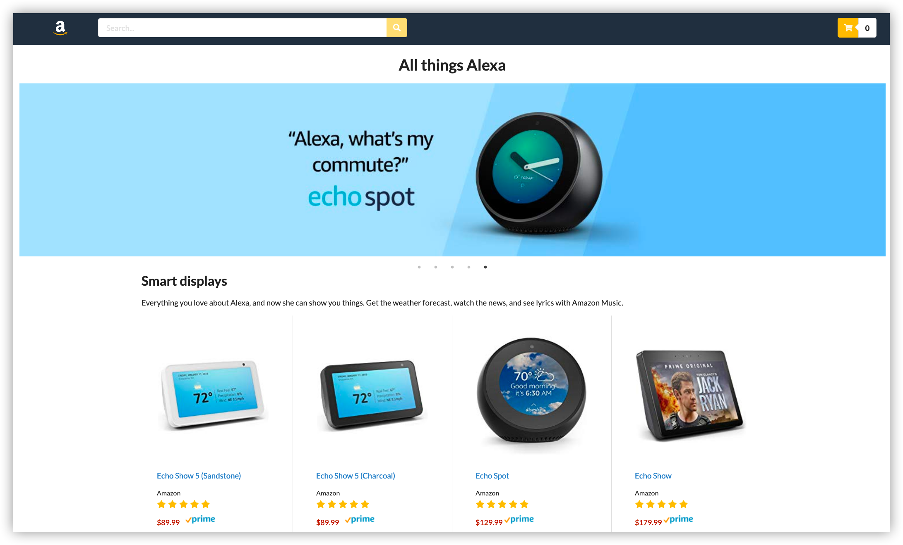

# Build your own omnichannel e-commerce experience

Welcome to the Amplify and Pinpoint builder session.  In this session...

In this builder session, you will:

- Create a cloud-based environment, which we will use as a base to deploy our backend environment and frontend web application

- Deploy a series of services to support our application into your AWS account.  Providing capability for Authentication, Database, API's and Analytics

- Deploy your web application to be hosted with a serverless S3 bucket

- Analyse the usage of your web application and react to events in your application in real time using Pinpoint

## Reference Architecture


The two components at the core of this lab are the front-end built using React and the AWS Amplify framework.  The front-end uses the Amplify Framework to create backend resources to support our application.

We will break this builder session into stages to build out our application.

## Store


## [1. Environment Setup](documentation/setup/)
We'll be using the AWS Cloud9 environment to work with Amplify and deploy our application.  This step will create and configure the Cloud9 environment.  We'll then install the AWS Amplify CLI.

## [2. Build the Amplify Backend](documentation/backend/)
Create our backend services (Pinpoint, Cognito, DynamoDB, API Gateway and Lambda)

## [3. Hosting for E-commerce Store](documentation/hosting/)
We'll use Amplify to setup hosting for our web application and deploy it to an S3 bucket.

## [4. Pinpoint Personalization](documentation/pinpoint/)
Explore Amazon Pinpoint and setup our segments and campaign to capture and react to events on our web application

<!-- ## [Homework: Integrate Personalize for Recommendations](documentation/personalize)
If you have extra time lets explore how we can integrate Amazon Personalize to provide predicitve user engagement -->

## Clean up
When you are done with the buidler session you can clean up your AWS account by running the command below in the Cloud9 environment that we created.

```Shell
amplify delete
```

Once you've deleted your Amplify project you can delete your Cloud9 instance.

## Contact

**Owner**: buchmans@amazon.com

## License Summary

This sample code is made available under the MIT-0 license. See the LICENSE file.